# 🚀 Smart Portfolio

<div align="center">

# 💼 Smart Portfolio

### AI-Powered Developer Portfolio built with React, TypeScript, Spring Boot and Spring AI

<p align="center">


</p>

</div>

---

# 📖 Overview

Smart Portfolio is a modern full-stack developer portfolio that showcases my projects, technical skills, certifications, GitHub profile, resume, and professional journey through an interactive and responsive web application.

The frontend is built using **React, TypeScript, Vite, Tailwind CSS**, and modern UI components, while the backend is powered by **Spring Boot** and **Spring AI**.

One of the key features of this project is an **AI Portfolio Assistant** that answers questions related to my skills, projects, education, certifications, and experience using **Google Gemini** through Spring AI.

The portfolio also includes a contact section, downloadable resume, animated UI, GitHub integration, project showcase, and responsive design for desktop, tablet, and mobile devices.

The UI foundation was created using modern AI-assisted development tools and was extensively customized, integrated with backend services, and enhanced with additional features, business logic, and personal content to create a production-ready portfolio.

---
# 🌍 Live Demo

## 🚀 Portfolio Website

https://smart-portfolio-kappa-eight.vercel.app/

---

## ⚙️ Backend API

https://smart-portfolio-backend-ama5.onrender.com

---

## 📂 GitHub Repository

https://github.com/jeevan-kaware/smart-portfolio

# ✨ Features

## 💼 Portfolio Features

- Professional Hero Section
- About Me
- Skills Showcase
- Education Timeline
- Certifications
- Projects Section
- GitHub Statistics
- Resume Download
- Responsive Design
- Smooth Animations

---

## 🤖 AI Portfolio Assistant

- Google Gemini Integration
- Spring AI Backend
- Portfolio Question Answering
- Project Information
- Skills Information
- Education Information
- Certificate Information
- Contact Information
- Short Intelligent Responses

---

## 📬 Contact Features

- Contact Form
- EmailJS Integration
- Backend Contact API
- Form Validation
- Success Notifications

---

## 🎨 UI Features

- Modern Responsive Design
- Interactive Components
- Animated Background
- Smooth Scrolling
- Loading Screen
- Custom Cursor
- Scroll Progress Indicator
- Mobile Friendly Layout

---

# 🛠 Tech Stack

| Technology | Used |
|------------|------|
| React 19 | ✅ |
| TypeScript | ✅ |
| Vite | ✅ |
| Tailwind CSS | ✅ |
| ShadCN UI | ✅ |
| Spring Boot Backend Integration | ✅ |
| Spring AI (Gemini) | ✅ |
| REST API | ✅ |
| EmailJS | ✅ |
| React Router | ✅ |
| Lucide React | ✅ |
| Framer Motion | ✅ |
| Docker | ✅ |
| Vercel Deployment | ✅ |

---

# 🧩 Architecture

```text
React Frontend

      │

      ▼

REST API Calls

      │

      ▼

Spring Boot Backend

      │

      ▼

Spring AI (Gemini)

      │

      ▼

AI Portfolio Assistant
```

---

# 📂 Project Structure

```text
frontend
│
├── public
│     └── assets
│
├── src
│     ├── assets
│     ├── components
│     ├── data
│     ├── hooks
│     ├── lib
│     ├── routes
│     ├── router.tsx
│     ├── server.ts
│     ├── styles.css
│     └── routeTree.gen.ts
│
├── package.json
├── vite.config.ts
└── tsconfig.json
```

---

# 📡 Backend Integration

The frontend communicates with a dedicated Spring Boot backend using REST APIs.

Available backend services include:

- AI Portfolio Chat
- Contact API
- Health Check API

## 📂 Backend Repository

https://github.com/jeevan-kaware/smart-portfolio-backend

## 🌐 Backend Live API

https://smart-portfolio-backend-ama5.onrender.com

---

# 🤖 AI Workflow

```text
User Question

      │

      ▼

React Chat Component

      │

      ▼

Spring Boot REST API

      │

      ▼

Spring AI (Gemini)

      │

      ▼

Portfolio Context

      │

      ▼

AI Response

      │

      ▼

Displayed in Chat Window
```

---

# 📧 Contact Workflow

```text
Visitor

      │

      ▼

Contact Form

      │

      ▼

EmailJS

      │

      ▼

Email Delivered
```

---

# 🐳 Docker Support

The backend project includes Docker support for containerized deployment.

Docker Features

- Multi-stage Docker Build
- Eclipse Temurin Java 21
- Optimized Runtime Image
- Production Ready Container
- Easy Cloud Deployment

---

# 🌟 Highlights

- Responsive Portfolio Design
- Java Backend Focused Portfolio
- AI Powered Portfolio Assistant
- Spring AI (Gemini) Integration
- Spring Boot Backend Integration
- REST API Communication
- Contact Form Support
- Resume Download
- Modern UI & Animations
- Modular React Components
- Docker Ready Backend
- Production Ready Deployment

---
# 📸 Screenshots

The following screenshots demonstrate the complete workflow and user interface of the Smart Portfolio application.

---

## 🏠 Hero Section

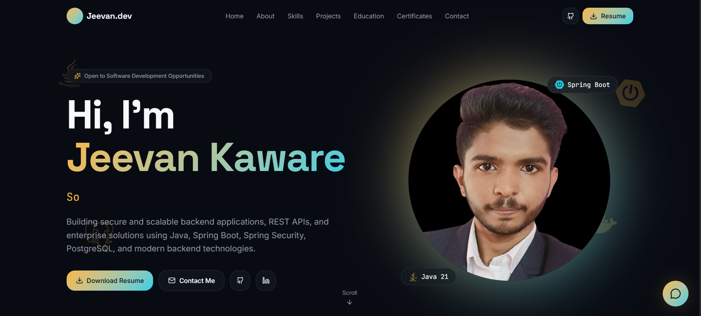

---

## 👨‍💻 About Me

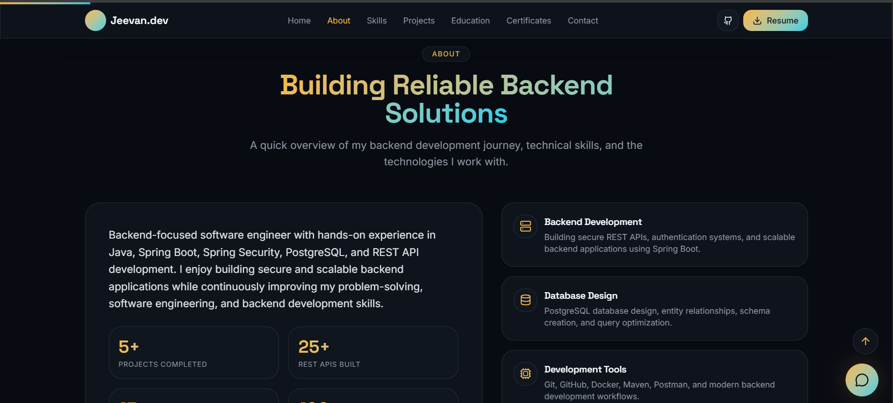

---

## 🛠 Skills

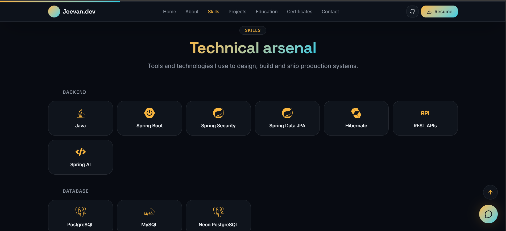

---

## 📂 Projects

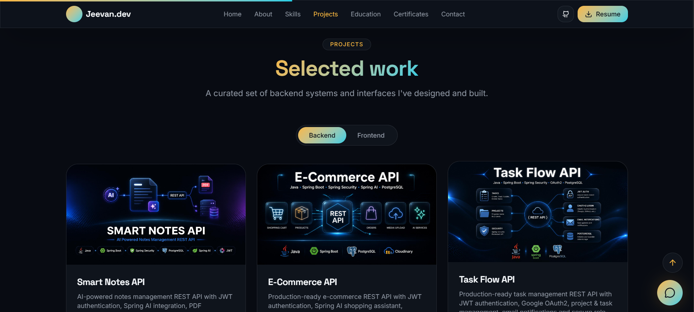

---

## 🤖 AI Portfolio Assistant

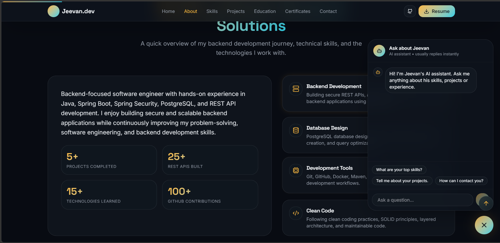

---

## 📜 Certificates

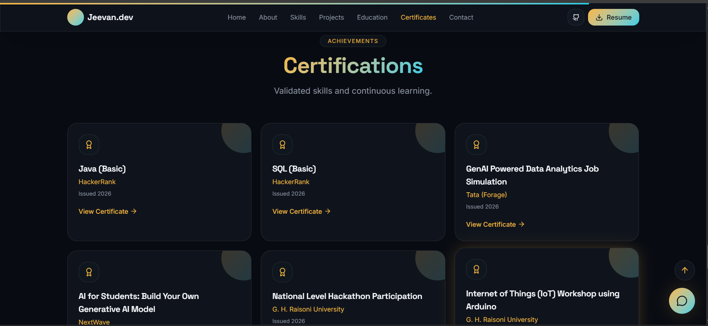

---

## 🎓 Education

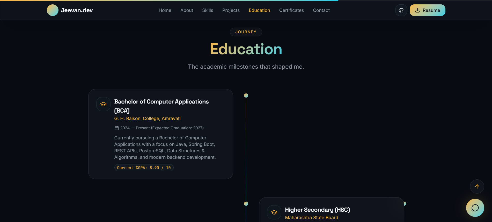

---

## 📧 Contact Section

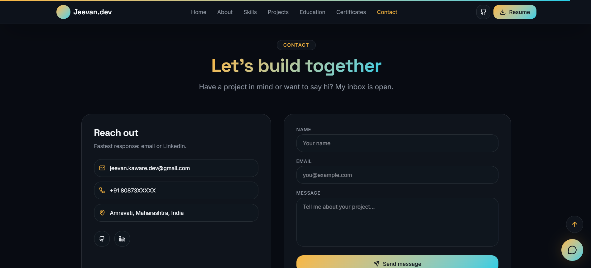

---

## 📱 Responsive Mobile View

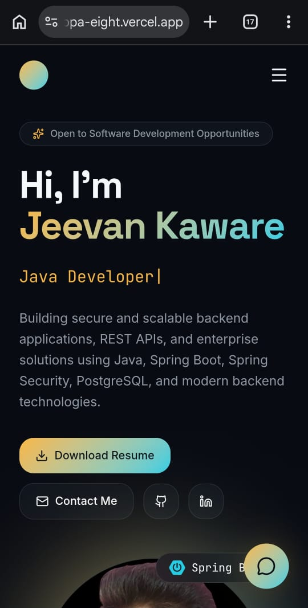

---

## 📄 Resume Download

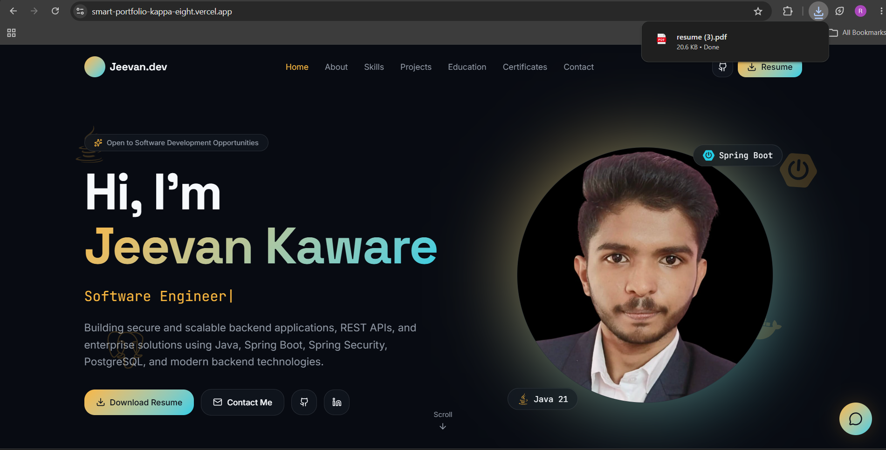

---

## ⚡ AI Response Example

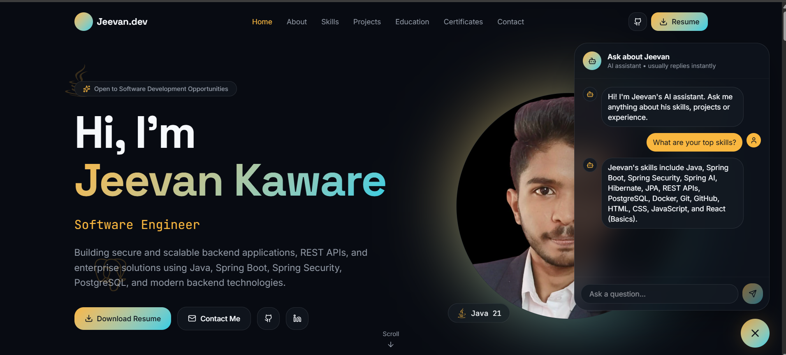

---

# 🚀 Future Improvements

- Dark / Light Theme Switch
- Multi-language Support
- Blog Section
- Project Filtering
- Visitor Analytics Dashboard
- Admin Panel
- More AI Portfolio Features
- Performance Optimization
- Unit Testing
- CI/CD Pipeline

---
# 📚 Learning Outcomes

This project helped me gain practical experience with

- React 19
- TypeScript
- Vite
- Tailwind CSS
- ShadCN UI
- Responsive UI Design
- Component-Based Architecture
- React Router
- REST API Integration
- Spring Boot Backend Integration
- Spring AI (Gemini)
- AI Prompt Design
- EmailJS Integration
- JSON Data Management
- Docker-based Backend Deployment
- Vercel Deployment
- Render Deployment
- Modern UI/UX Design
- Performance Optimization
- Clean Folder Structure
- Production-ready Frontend Development

---

# 👨‍💻 Author

## Jeevan Kaware

Java Backend Developer

### GitHub

https://github.com/jeevan-kaware

### Project Repository

https://github.com/jeevan-kaware/smart-portfolio

### Backend Repository

https://github.com/jeevan-kaware/smart-portfolio-backend

### LinkedIn

https://www.linkedin.com/in/jeevan-kaware-080643355

### Portfolio

https://smart-portfolio-kappa-eight.vercel.app/
 
---

# ⭐ If you like this project

If you found this project helpful, please consider giving it a ⭐ on GitHub.

Your support motivates me to continue building high-quality Java Backend and Full Stack projects.

---

<div align="center">

# 🚀 Built with React, TypeScript, Tailwind CSS, Spring Boot, Spring AI (Gemini) and ❤️

### Thank you for visiting this repository.

</div>
